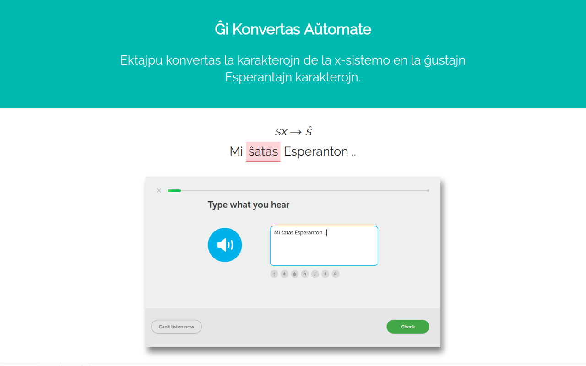

# ektajpu #

This extension converts the x-system characters into their proper Esperanto characters.

**This converts the characters live, as you type.**

Example:
cx ⟶ ĉ
gx ⟶ ĝ
hx ⟶ ĥ
jx ⟶ ĵ
sx ⟶ ŝ
ux ⟶ ŭ

## Install ##

Install it from the [Chrome Web Store](https://chrome.google.com/webstore/detail/ektajpu-esperanto-text-co/imcphpmkkohhbaipkceicfheidilofbo)

Install it from the [Firefox Mozilla Add-on Store](https://addons.mozilla.org/addon/ektajpu-esperanto-converter/)

Install it from the [Opera Add-on Store](https://addons.opera.com/en/extensions/details/ektajpu-esperanto-text-converter/?display=en)

### Changes ###

Read the CHANGELOG.md for a list of updates.

### Feature Requests ###

If there are any features you would like to see in this extension (or another), please contact me.
